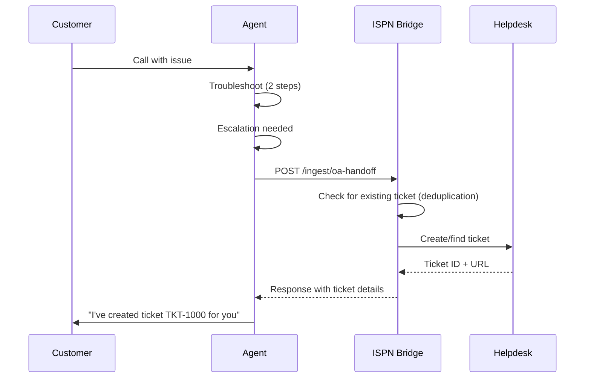

# Integration Guide

Complete guide for integrating the ISPN Helpdesk Bridge MCP Server with ElevenLabs agents and Claude Desktop.

---

## Table of Contents

1. [ElevenLabs Agent Configuration](#elevenlabs-agent-configuration)
2. [Claude Desktop Configuration](#claude-desktop-configuration)
3. [Example Integration Flows](#example-integration-flows)
4. [Troubleshooting](#troubleshooting)

---

## ElevenLabs Agent Configuration

### Webhook Setup

Configure your ElevenLabs agent to send handoff requests to the ISPN Helpdesk Bridge API.

#### Webhook URL

```
POST https://api.example.com/ingest/oa-handoff
```

**Development:**
```
POST http://localhost:3000/ingest/oa-handoff
```

#### Authentication Configuration

**Option 1: Shared Token (Simple)**

Add header to webhook requests:
```
x-auth-token: your-secret-token-here
```

**Option 2: HMAC Signature (Secure)**

Add headers to webhook requests:
```
x-signature: sha256=<calculated_signature>
x-timestamp: <unix_timestamp_ms>
```

**Signature Calculation:**
```javascript
const crypto = require('crypto');

const timestamp = Date.now().toString();
const payload = timestamp + JSON.stringify(requestBody);
const signature = crypto
  .createHmac('sha256', webhookSecret)
  .update(payload)
  .digest('hex');

const headers = {
  'x-signature': `sha256=${signature}`,
  'x-timestamp': timestamp,
  'Content-Type': 'application/json'
};
```

### Payload Format

#### Minimal Request

```json
{
  "note": "Category: WiFi\nReason: CallerRequested\nSummary: Customer unable to connect to WiFi\nConfidence: 0.85"
}
```

#### Full Request with Deduplication

```json
{
  "note": "Category: Outage\nReason: TwoStepsNoResolve\nSummary: Complete service outage affecting multiple customers\nConfidence: 0.95",
  "category": "Outage",
  "escalationReason": "TwoStepsNoResolve",
  "confidence": "0.95",
  "callerNumber": "+12345678900",
  "oaKey": "oa-12345",
  "source": "OutageAgent"
}
```

#### Note Format Requirements

**4-Line Format:**
```
Category: <category>
Reason: <escalationReason>
Summary: <summary>
Confidence: <confidence>
```

**Validation:**
- Total length: ≤350 characters
- Summary length: ≤250 characters
- Confidence: 0.0-1.0 format (e.g., "0.85")

**Categories:**
- `Outage` - Service outage
- `WiFi` - WiFi connectivity issues
- `CGNAT` - CGNAT/NAT issues
- `Wiring` - Physical wiring problems
- `EquipmentReturn` - Equipment return requests
- `Unknown` - Uncategorized issues

**Escalation Reasons:**
- `CallerRequested` - Customer requested human support
- `TwoStepsNoResolve` - Two troubleshooting steps didn't resolve
- `OutOfScope` - Issue outside agent capabilities
- `SafetyRisk` - Safety or security concern
- `BillingOrAccount` - Billing or account issue
- `Other` - Other escalation reason

### Response Handling

#### Success Response (200 OK)

**New Ticket Created:**
```json
{
  "status": "ok",
  "created": true,
  "ticketId": "TKT-1000",
  "ticketUrl": "https://helpdesk.example.com/tickets/1000",
  "category": "WiFi",
  "escalationReason": "CallerRequested",
  "confidence": "0.85",
  "echo": {
    "oaKey": "oa-12345",
    "callerNumber": "+12345678900"
  }
}
```

**Existing Ticket Found (Deduplication):**
```json
{
  "status": "ok",
  "created": false,
  "ticketId": "TKT-1000",
  "ticketUrl": "https://helpdesk.example.com/tickets/1000",
  "category": "WiFi",
  "escalationReason": "CallerRequested",
  "confidence": "0.85",
  "echo": {
    "oaKey": "oa-12345",
    "callerNumber": "+12345678900"
  }
}
```

#### Error Responses

**Authentication Required (401):**
```json
{
  "status": "error",
  "code": "AUTH_REQUIRED",
  "message": "Authentication required (provide x-auth-token or x-signature + x-timestamp)"
}
```

**Validation Error (400):**
```json
{
  "status": "error",
  "code": "VALIDATION_ERROR",
  "message": "Invalid request payload",
  "details": {
    "note": {
      "_errors": ["String must contain at least 10 character(s)"]
    }
  }
}
```

**Rate Limit Exceeded (429):**
```json
{
  "status": "error",
  "code": "RATE_LIMIT_EXCEEDED",
  "message": "Too many requests. Rate limit: 10 requests per second",
  "retryAfter": 1
}
```

### Idempotency

To prevent duplicate submissions, include an `Idempotency-Key` header:

```http
POST /ingest/oa-handoff
Content-Type: application/json
x-auth-token: your-token
Idempotency-Key: unique-request-id-123

{
  "note": "..."
}
```

**Behavior:**
- Same key + same payload = Cached response (200)
- Same key + different payload = Conflict error (409)
- Idempotency window: 15 minutes

---

## Claude Desktop Configuration

### MCP Server Installation

#### 1. Build the Project

```bash
cd /path/to/ispn-helpdesk-mcp
npm install
npm run build
```

#### 2. Configure Claude Desktop

**macOS Configuration File:**
```bash
~/Library/Application Support/Claude/claude_desktop_config.json
```

**Linux Configuration File:**
```bash
~/.config/Claude/claude_desktop_config.json
```

**Configuration:**
```json
{
  "mcpServers": {
    "ispn-helpdesk": {
      "command": "node",
      "args": ["/absolute/path/to/ispn-helpdesk-mcp/dist/mcp-server.js"]
    }
  }
}
```

**Example (macOS):**
```json
{
  "mcpServers": {
    "ispn-helpdesk": {
      "command": "node",
      "args": ["/Users/username/projects/ispn-helpdesk-mcp/dist/mcp-server.js"]
    }
  }
}
```

#### 3. Restart Claude Desktop

Close and reopen Claude Desktop to load the MCP server.

### MCP Tools Available

#### 1. helpdesk.create_ticket

**Purpose:** Create a new helpdesk ticket directly (bypasses deduplication)

**Example:**
```
Create a new ticket:
- Description: "Customer experiencing WiFi connectivity issues after router reset"
- Category: WiFi
- Escalation Reason: TwoStepsNoResolve
- Caller Number: +12345678900
```

**Response:**
```json
{
  "success": true,
  "ticketId": "TKT-1000",
  "ticketUrl": "https://helpdesk.example.com/tickets/1000",
  "category": "WiFi",
  "escalationReason": "TwoStepsNoResolve"
}
```

#### 2. helpdesk.append_note

**Purpose:** Append a note to an existing helpdesk ticket

**Example:**
```
Append a note to ticket TKT-1000:
"Customer confirmed WiFi is working after router reset"
```

**Response:**
```json
{
  "success": true,
  "message": "Note appended successfully",
  "ticketId": "TKT-1000"
}
```

#### 3. helpdesk.find_or_create_ticket

**Purpose:** Find existing ticket or create new one (with deduplication)

**Example:**
```
Find or create ticket:
- Description: "Customer unable to connect to WiFi"
- Category: WiFi
- Escalation Reason: CallerRequested
- Caller Number: +12345678900
- OA Key: oa-12345
```

**Response (Existing Ticket):**
```json
{
  "success": true,
  "created": false,
  "ticketId": "TKT-1000",
  "ticketUrl": "https://helpdesk.example.com/tickets/1000",
  "message": "Existing ticket found (deduplication)"
}
```

#### 4. ingest.render_note

**Purpose:** Render a 4-line formatted note from components

**Example:**
```
Render a note:
- Category: WiFi
- Escalation Reason: TwoStepsNoResolve
- Summary: Customer unable to connect to WiFi after router reset
- Confidence: 0.85
```

**Response:**
```json
{
  "success": true,
  "note": "Category: WiFi\nReason: TwoStepsNoResolve\nSummary: Customer unable to connect to WiFi after router reset\nConfidence: 0.85",
  "charCount": 115,
  "lineCount": 4
}
```

#### 5. ingest.oa_handoff

**Purpose:** Complete OA handoff workflow (render note + find/create ticket)

**Example:**
```
Process OA handoff:
- Note: "Category: Outage\nReason: CallerRequested\nSummary: Complete service outage\nConfidence: 0.95"
- Category: Outage
- Escalation Reason: CallerRequested
- Caller Number: +12345678900
- OA Key: oa-12345
- Source: OutageAgent
```

**Response:**
```json
{
  "success": true,
  "created": true,
  "ticketId": "TKT-1001",
  "ticketUrl": "https://helpdesk.example.com/tickets/1001",
  "category": "Outage",
  "escalationReason": "CallerRequested",
  "confidence": "0.95",
  "echo": {
    "oaKey": "oa-12345",
    "callerNumber": "+12345678900"
  }
}
```

---

## Example Integration Flows

### Flow 1: ElevenLabs Agent Handoff

**Scenario:** Customer calls, agent determines escalation needed



**Implementation:**

1. **Agent determines escalation:**
   - Caller requested human support
   - Two troubleshooting steps didn't resolve
   - Issue outside agent capabilities

2. **Agent renders note:**
   ```
   Category: WiFi
   Reason: TwoStepsNoResolve
   Summary: Customer unable to connect after router reset
   Confidence: 0.85
   ```

3. **Agent calls webhook:**
   ```bash
   curl -X POST https://api.example.com/ingest/oa-handoff \
     -H "x-auth-token: your-token" \
     -H "Content-Type: application/json" \
     -d '{
       "note": "Category: WiFi\nReason: TwoStepsNoResolve\nSummary: Customer unable to connect after router reset\nConfidence: 0.85",
       "category": "WiFi",
       "escalationReason": "TwoStepsNoResolve",
       "confidence": "0.85",
       "callerNumber": "+12345678900",
       "oaKey": "oa-12345",
       "source": "OutageAgent"
     }'
   ```

4. **ISPN Bridge processes:**
   - Authenticates request
   - Validates payload
   - Checks for existing ticket (by oaKey or caller+category)
   - Creates or finds ticket
   - Returns response

5. **Agent informs customer:**
   - "I've created ticket TKT-1000"
   - "You can track it at https://helpdesk.example.com/tickets/1000"
   - "A technician will contact you within 2 hours"

### Flow 2: Claude Desktop Direct Ticket Creation

**Scenario:** User asks Claude to create a helpdesk ticket

1. **User request:**
   ```
   Create a helpdesk ticket for WiFi issues:
   - Customer can't connect to WiFi after router reset
   - Caller: +12345678900
   - Escalation: Two troubleshooting steps didn't work
   ```

2. **Claude calls MCP tool:**
   ```typescript
   helpdesk.create_ticket({
     description: "Customer unable to connect to WiFi after router reset. Tried restarting router and device with no success.",
     category: "WiFi",
     escalationReason: "TwoStepsNoResolve",
     callerNumber: "+12345678900",
     source: "ATOM"
   })
   ```

3. **ISPN Bridge processes:**
   - Validates input
   - Creates ticket (bypasses deduplication)
   - Returns ticket details

4. **Claude responds:**
   ```
   I've created helpdesk ticket TKT-1000 for the WiFi issue.

   Ticket Details:
   - ID: TKT-1000
   - URL: https://helpdesk.example.com/tickets/1000
   - Category: WiFi
   - Escalation: Two steps didn't resolve

   A technician will be assigned shortly.
   ```

### Flow 3: Deduplication Scenario

**Scenario:** Same customer calls back about same issue

1. **First call (creates ticket):**
   ```json
   {
     "note": "...",
     "oaKey": "oa-12345",
     "callerNumber": "+12345678900",
     "category": "WiFi"
   }
   ```
   Response: `created: true, ticketId: "TKT-1000"`

2. **Second call (finds existing ticket):**
   ```json
   {
     "note": "...",
     "oaKey": "oa-12345",
     "callerNumber": "+12345678900",
     "category": "WiFi"
   }
   ```
   Response: `created: false, ticketId: "TKT-1000"` (same ticket)

3. **Agent behavior:**
   - "I see you already have ticket TKT-1000 open"
   - "Let me add this new information to that ticket"
   - Calls `helpdesk.append_note` to add follow-up

---

## Troubleshooting

### Common Errors

#### 1. Authentication Failed

**Error:**
```json
{
  "status": "error",
  "code": "AUTH_REQUIRED",
  "message": "Authentication required"
}
```

**Solutions:**
- Verify `x-auth-token` header is present
- Check token matches `AUTH_TOKEN` in `.env`
- For HMAC: Verify signature calculation is correct
- Check timestamp is within 5-minute window

**Test Authentication:**
```bash
# Test shared token
curl -X POST http://localhost:3000/ingest/oa-handoff \
  -H "x-auth-token: test-token-dev-only-change-in-production" \
  -H "Content-Type: application/json" \
  -d '{"note":"Category: WiFi\nReason: CallerRequested\nSummary: Test\nConfidence: 0.85"}'
```

#### 2. Validation Error

**Error:**
```json
{
  "status": "error",
  "code": "VALIDATION_ERROR",
  "message": "Invalid request payload",
  "details": {"note": {"_errors": ["Required"]}}
}
```

**Solutions:**
- Verify `note` field is present
- Check note format (4 lines)
- Verify note length ≤350 characters
- Check `callerNumber` is E.164 format (if provided)
- Verify `confidence` is 0.0-1.0 format

#### 3. Rate Limit Exceeded

**Error:**
```json
{
  "status": "error",
  "code": "RATE_LIMIT_EXCEEDED",
  "message": "Too many requests",
  "retryAfter": 1
}
```

**Solutions:**
- Wait `retryAfter` seconds before retrying
- Implement exponential backoff
- Check rate limit headers:
  - `RateLimit-Limit`: Maximum requests per window
  - `RateLimit-Remaining`: Remaining requests
  - `RateLimit-Reset`: Reset timestamp

#### 4. MCP Tools Not Showing

**Issue:** Claude Desktop doesn't show ISPN tools

**Solutions:**
1. Verify config file path:
   ```bash
   # macOS
   cat ~/Library/Application\ Support/Claude/claude_desktop_config.json

   # Linux
   cat ~/.config/Claude/claude_desktop_config.json
   ```

2. Check configuration format:
   ```json
   {
     "mcpServers": {
       "ispn-helpdesk": {
         "command": "node",
         "args": ["/absolute/path/to/dist/mcp-server.js"]
       }
     }
   }
   ```

3. Verify build completed:
   ```bash
   ls -la /path/to/ispn-helpdesk-mcp/dist/mcp-server.js
   ```

4. Check MCP server logs:
   ```bash
   # Run manually to see errors
   node /path/to/ispn-helpdesk-mcp/dist/mcp-server.js
   ```

5. Restart Claude Desktop completely

### Debug Logging

Enable debug logging to troubleshoot issues:

**File:** `.env`
```bash
LOG_LEVEL=debug
```

**View Logs:**
```bash
# HTTP Server
pm2 logs ispn-http

# MCP Server
pm2 logs ispn-mcp

# Or with systemd
sudo journalctl -u ispn-http -f
sudo journalctl -u ispn-mcp -f
```

### Health Check Usage

**Check Service Status:**
```bash
# Liveness (is service running?)
curl http://localhost:3000/healthz

# Readiness (is service ready to accept requests?)
curl http://localhost:3000/readyz
```

**Expected Responses:**
```json
// Liveness
{"status":"ok","service":"ispn-helpdesk-bridge","timestamp":"..."}

// Readiness (healthy)
{"status":"ready","service":"ispn-helpdesk-bridge","checks":{"helpdesk":"healthy"},"timestamp":"..."}

// Readiness (unhealthy)
{"status":"unavailable","service":"ispn-helpdesk-bridge","checks":{"helpdesk":"unhealthy"},"timestamp":"..."}
```

---

## Support

For integration issues, contact:
- **Email:** support@example.com
- **Documentation:** https://docs.example.com
- **API Reference:** See [OpenAPI Specification](./openapi.yaml)
- **Issues:** https://github.com/yourorg/ispn-helpdesk-mcp/issues
